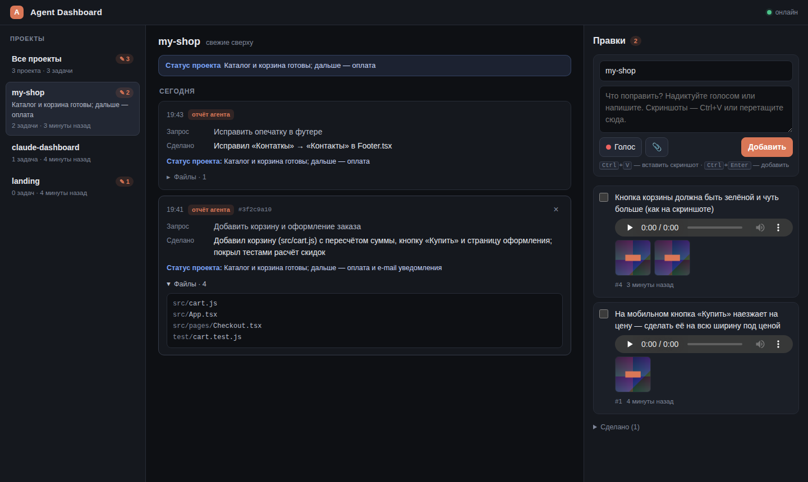

# Agent Dashboard

Локальный дашборд для отслеживания работы агентов Claude Code по нескольким проектам: лента задач (что просили → что сделано → какие файлы), статус каждого проекта и блок «Правки» — голосовые заметки с расшифровкой, скриншоты и галочка «сделано». Открытые правки сами попадают в контекст следующей сессии Claude Code в этом проекте.



**Стек:** Node.js + Express + SQLite (better-sqlite3), фронтенд — один `public/index.html` без сборки. Порт 4000.

## Установка

Нужен Node.js 20+.

```bash
git clone https://github.com/Kirito-MKD/claude-dashboard.git ~/agent-dashboard
cd ~/agent-dashboard
npm install
npm run setup       # хуки в ~/.claude/settings.json + инструкция в ~/.claude/CLAUDE.md
npm run autostart   # запуск сервера сейчас и при каждом входе в систему
```

Откройте http://localhost:4000. В Claude Code проверьте командой `/hooks`, что появились хуки `SessionStart` и `SessionEnd`. Они сработают в **новых** сессиях.

Если автозапуск не нужен, запускайте сервер вручную: `npm start`.

### Что делает `npm run setup`

- **`~/.claude/settings.json`**: добавляет два хука и не трогает остальное: разрешения, модель, statusLine и чужие хуки остаются как были. Перед записью сохраняет резервную копию `settings.json.bak-<дата>`. Повторный запуск ничего не дублирует. Если папку дашборда перенесли, запустите setup ещё раз, и путь в хуках обновится. Если в `settings.json` невалидный JSON (например, с комментариями), скрипт завершится с ошибкой и файл не изменит.
- **`~/.claude/CLAUDE.md`**: дописывает в конец блок между `<!-- agent-dashboard:start -->` и `<!-- agent-dashboard:end -->`: «В конце каждой задачи отправь curl POST на localhost:4000/api/tasks с кратким summary и статусом проекта. Выполненные правки отметь через PATCH», плюс готовые примеры curl.

`npm run setup -- --dry-run` показывает изменения, ничего не записывая. `npm run uninstall-hooks` убирает только то, что добавил setup.

## Автозапуск при входе в систему

`npm run autostart` сам определяет ОС. Сервер запускается тем же `node`, которым вы выполнили команду: под него собран better-sqlite3, а у launchd и systemd нет вашего `PATH` из nvm или volta. Если вы смените версию Node, выполните `npm rebuild && npm run autostart` заново.

| ОС | Как устроено | Полезные команды |
|---|---|---|
| **macOS** | LaunchAgent `~/Library/LaunchAgents/com.agent-dashboard.plist`: запуск при входе, перезапуск при падении, лог в `data/server.log` | стоп: `launchctl bootout gui/$(id -u)/com.agent-dashboard` |
| **Linux** | systemd user-сервис `~/.config/systemd/user/agent-dashboard.service` | `systemctl --user status agent-dashboard`, лог: `journalctl --user -u agent-dashboard -f`. Чтобы сервер работал без входа в систему: `loginctl enable-linger $USER` |
| **Linux без systemd / WSL** | `~/.config/autostart/agent-dashboard.desktop` (графическая сессия) + сервер запускается сразу | для WSL скрипт напечатает строку для `~/.bashrc` |
| **Windows** | `agent-dashboard.vbs` в папке «Автозагрузка» (`shell:startup`), запускает node без окна | удалить: `npm run autostart:remove` |

Предпросмотр без установки: `node scripts/autostart.js --print` (для другой ОС: `--platform=darwin|linux|win32`). Убрать автозапуск: `npm run autostart:remove`.

## Как это работает

```
Claude Code ──SessionStart──▶ hooks/session-start.js ──GET /api/notes?project=…&status=open──▶ контекст сессии
     │                                                          (текст правок + пути к скриншотам)
     ├── в конце задачи (по CLAUDE.md) ── curl POST /api/tasks, curl PATCH /api/notes/:id
     │
     └──SessionEnd──▶ hooks/session-end.js ──▶ разбор транскрипта ──POST /api/tasks──▶ SQLite ──SSE──▶ браузер
```

- **SessionEnd** (`hooks/session-end.js`) читает `transcript_path` из stdin и собирает:
  - первый запрос пользователя, без служебных вставок и команд вроде `/clear` или `/model`;
  - `file_path` всех успешных `Edit`, `Write` и `MultiEdit` (и `NotebookEdit`), включая изменения сабагентов;
  - последний ответ агента как «Итог».

  Проект — это имя папки проекта: `$CLAUDE_PROJECT_DIR`, а если его нет, то `cwd`. Claude Code даёт SessionEnd-хукам около 1,5 с, поэтому хук сразу возвращает управление, а разбор и отправку делает фоновый процесс. Если сервер не запущен, хук молча выходит. Для одной сессии хук обновляет свою запись, а не создаёт новую.
- **SessionStart** (`hooks/session-start.js`) выводит в stdout открытые правки проекта (от старых к новым) с абсолютными путями к скриншотам, чтобы Claude мог открыть их через Read, и `session_id` сессии. Если сервер выключен, хук ничего не выводит.
- **Лента** показывает два вида записей, связанных общим `#session`: «отчёт агента» (curl из CLAUDE.md, с summary и статусом) и «авто · конец сессии» (из хука, с полным списком файлов).

## Интерфейс

- Слева проекты с последним статусом и счётчиком открытых правок. Выбранный проект сохраняется в адресе (`#p=имя`).
- В ленте свежие записи сверху, с разделителями по дням. Длинные запросы сворачиваются, список файлов раскрывается по клику. Новые записи появляются сами (Server-Sent Events).
- Блок «Правки»:
  - кнопка «Голос» записывает звук через MediaRecorder и параллельно расшифровывает его Web Speech API (`ru-RU`). Текст сразу попадает в поле, и его можно поправить перед отправкой;
  - скриншоты вставляются через `Ctrl+V` в любом месте страницы, перетаскиваются в окно или добавляются кнопкой 📎;
  - `Ctrl+Enter` добавляет правку, галочка отмечает её «сделано»;
  - двойной клик по тексту правки открывает редактирование.
- Тёмная тема, работает и на узком экране.

> Расшифровка голоса работает в Chrome и Edge. Браузер отправляет звук на свой облачный сервис распознавания. Сама аудиозапись хранится только локально, в `data/uploads`. В Firefox и Safari запись сохранится, а текст нужно будет ввести вручную.

## API

Все ответы в JSON. Даты в ISO 8601 (UTC).

| Метод | Путь | Описание |
|---|---|---|
| `POST` | `/api/tasks` | `{project*, task, summary, files[], status, session_id}`. `files` можно передать массивом, JSON-строкой или строкой через запятую |
| `GET` | `/api/projects` | `[{name, tasks, open_notes, status, last_activity}]`, где `status` — последний непустой статус проекта |
| `GET` | `/api/tasks?project=&limit=&before=` | задачи, свежие сверху (`limit` ≤ 500, `before` — id для пагинации) |
| `DELETE` | `/api/tasks/:id` | удалить запись |
| `POST` | `/api/notes` | multipart: `project*`, `text`, `audio` (1 файл), `images` (до 30). Можно отправить и JSON `{project, text}` |
| `GET` | `/api/notes?project=&status=open` | правки, свежие сверху; добавлены абсолютные пути `audio_file` и `image_files` |
| `PATCH` | `/api/notes/:id` | `{status: "open" \| "done"}` и/или `{text}` |
| `DELETE` | `/api/notes/:id` | удалить правку вместе с файлами |
| `GET` | `/api/events` | SSE-поток изменений (`event: change`) |

```bash
# задача
curl -s -X POST localhost:4000/api/tasks -H 'Content-Type: application/json' \
  -d '{"project":"my-app","task":"Экспорт в CSV","summary":"Добавил /export","files":["src/export.ts"],"status":"MVP готов"}'

# правка со скриншотом и голосом
curl -s -X POST localhost:4000/api/notes -F project=my-app -F 'text=Поправить отступы' \
  -F images=@screen.png -F audio=@voice.webm

# отметить сделанной
curl -s -X PATCH localhost:4000/api/notes/1 -H 'Content-Type: application/json' -d '{"status":"done"}'
```

## Данные и настройки

База и файлы лежат в `~/agent-dashboard/data/` (`dashboard.db`, `uploads/`). Для резервной копии достаточно скопировать эту папку.

| Переменная | По умолчанию | Для чего |
|---|---|---|
| `PORT` | `4000` | порт сервера |
| `HOST` | `127.0.0.1` | адрес, на котором слушает сервер |
| `AGENT_DASHBOARD_DATA` | `./data` | папка с базой и загрузками |
| `AGENT_DASHBOARD_ALLOWED_HOSTS` | — | дополнительные имена хостов через запятую, если открываете дашборд не с localhost |
| `AGENT_DASHBOARD_URL` / `AGENT_DASHBOARD_PORT` | `http://127.0.0.1:4000` | куда ходят хуки |
| `AGENT_DASHBOARD_DEBUG=1` | — | хуки пишут ошибки в stderr |

Если меняете порт, запустите `PORT=5000 npm run setup` и `PORT=5000 npm run autostart`, а в `~/.claude/settings.json` добавьте `"env": {"AGENT_DASHBOARD_PORT": "5000"}`.

**Безопасность.** Сервер слушает только `127.0.0.1`. Запросы, меняющие данные, с чужих сайтов (заголовок `Origin`) и запросы с чужим `Host` (DNS rebinding) отклоняются. Это важно, потому что текст правок попадает в контекст Claude.

## Проверка и отладка

```bash
npm test                                   # тесты API, хуков, разбора транскрипта и установщика
curl localhost:4000/api/health             # {"ok":true}
echo '{"cwd":"'$PWD'","session_id":"test"}' | node hooks/session-start.js   # что увидит Claude
```

Хуки не срабатывают? Проверьте `/hooks` в Claude Code и запустите `claude --debug`. Хук можно запустить вручную с `AGENT_DASHBOARD_DEBUG=1`.

## Удаление

```bash
cd ~/agent-dashboard
npm run uninstall-hooks     # убрать хуки и блок из CLAUDE.md
npm run autostart:remove    # убрать автозапуск
rm -rf ~/agent-dashboard
```
